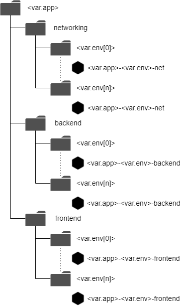

A simple, full stack architecture for a web app, made with Terraform
on Google Cloud Platform. This creates:

- An http/https frontend
- HTTPS certs from Google certificate manager
- Cloud DNS
- An haproxy frontend, with docker images inside an autoscaling instance group
- An apache backend, also on docker images inside an autoscaling instance group
- Support for multiple environments (e.g. dev/prod/uat)
- A service/host project architecture, as per best practices
- Projects are organized in folders to help privilege separation
- A simple (hopefully!) to understand modules architecture, with lavishly  
  commented code

Everything inside this folder/project tree:

REQUIREMENTS

To run this example you need a Google Organization.
This, because Google Cloud doesn't support VPC Sharing without an Organization.
That would mean all the resources in a single project, not acceptable in an
enterprise environment.
You also need to configure your Gcloud CLI with a user with high privileges,
I think you need at least the Editor or Owner role on the org.

INSTRUCTIONS

- Copy the site-tfvars.sample to site-tfvars.tf and populate it with the  
  required info (customer id, domain name, org id, billing account id)
- Modify the variables.tf with the desired region, app name, list of
  environments, and subnets for every env.
- The Google Cloud default billable projects quota is 5, and changing it
  involves an authorization procedure with Google support. If you didn't
  do that, don't create more than one env, as every env creates 3 projects.
- You must then add some glue records on your dns, to delegate resolution
  of the zone gcp.${var.organization.domain}. You can find the records in the
  dns_name output map
- And voila', the apps are ready! you can find the fqdn in the app_name output.
- The https certificate, and the listener on the GLB, will be available only
  after you put the NS records on your dns and the certificate manager
  validates your certificate. Be patient. If it doesn't work after a good
  amount of minutes (let's say half an hour or more) you could try to taint
  the dns auth resource and reapply.

BUGS

Destroy doesn't work correctly. It stops because the certificate manager api
is fully confident of the existance of some kind of dependent resource...
that, in reality, don't exist. So you will need to delete the frontend
projects manually and relaunch the destroy.
